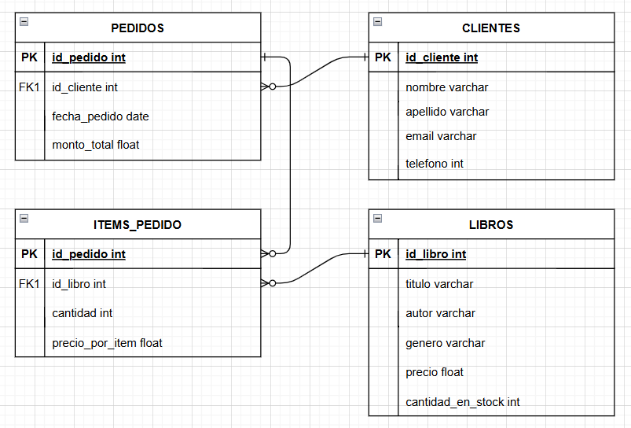

# BookStore - Esquema y Scripts SQL

---

## Metadatos

```
Host:                         Bianca Razzoli
Versión del servidor:         MP0224
SO del servidor:              MP0224
Base de Datos:                BookStore
Lenguajes de Programación:    MariaDB, SQLite, Batch
Versiones:                    MariaDB-11.6.2, HeidiSQL 12.8.0.6908
```

---

## ÍNDICE

- **PARTE 1. Diseño de la Base de Datos**
  - 1. Elección del SGBD
  - 2. Esquema de la base de datos
  - 3. Explicación de las decisiones de diseño

- **PARTE 2 y 3. Creación de la Base de Datos y Gestión de Usuarios**
  - 1. Creación de la base de datos, tablas y datos

- **PARTE 4. Scripting para optimizar**
  - 1. Procedimiento almacenado para gestión de inventario
  - 2. Informes de ventas
  - 3. Respaldo y recuperación

- **PARTE 5. Índices y optimización de consultas**
  - 1. Consulta compleja
  - 2. Análisis y optimización de consulta
  - 3. Creación de índices

- **PARTE 6. Planificación de tareas administrativa**
  - 1. Programación de copias de seguridad
  - 2. Importancia de la planificación administrativa

- **CONCLUSIONES**
- **WEBGRAFÍA**

---

## PARTE 1. Diseño de la Base de Datos

### 1. Elección del SGBD

Se ha optado por MySQL como SGBD por:
   - Soporte de múltiples usuarios y sistema avanzado de privilegios.
   - Permite triggers complejos y procedimientos almacenados.
   - Facilidad de automatización de backups con mysqldump.
   - Mejor escalabilidad para grandes volúmenes de datos frente a SQLite.


### 2. Esquema de la base de datos



*(Ver código de creación de tablas más abajo)*

### 3. Explicación de las decisiones de diseño

/* El sistema gestiona ventas de libros con las tablas:
   - clientes: datos personales.
   - libros: información de libros y stock.
   - pedidos: pedidos realizados por clientes.
   - items_pedido: libros incluidos en cada pedido.

Relaciones:
- Un cliente puede tener varios pedidos (1:N).
- Un pedido puede incluir varios libros y viceversa (N:M) mediante items_pedido.
- Índices en campos clave para optimizar búsquedas y garantizar unicidad (ej. teléfono).

---

## PARTE 2 y 3. Creación de la Base de Datos y Gestión de Usuarios

### 1. Creación de la base de datos, tablas y datos

```sql
CREATE DATABASE IF NOT EXISTS `bookstore`;
USE `bookstore`;

CREATE TABLE IF NOT EXISTS `clientes` (
  `id_cliente` int(11) NOT NULL AUTO_INCREMENT,
  `nombre` varchar(50) NOT NULL DEFAULT '0',
  `apellido` varchar(50) NOT NULL DEFAULT '0',
  `email` varchar(50) NOT NULL DEFAULT '0',
  `telefono` int(11) NOT NULL DEFAULT '0',
  PRIMARY KEY (`id_cliente`),
  UNIQUE KEY `telefono` (`telefono`),
  KEY `idx_clientes_telefono` (`telefono`)
) ENGINE=InnoDB AUTO_INCREMENT=11 DEFAULT CHARSET=utf8mb4;

INSERT INTO `clientes` (`id_cliente`, `nombre`, `apellido`, `email`, `telefono`)
VALUES
  (1, 'Ana', 'Garcia', 'ana.garcia@g.com', 666111222),
  (2, 'Maria', 'Lopez', 'maria.lopez@g.com', 666111333),
  (3, 'Gorka', 'Martinez', 'gorka.martinez@g.com', 666111444),
  (4, 'David', 'Perez', 'david.perez@g.com', 666222555),
  (5, 'Julia', 'Maion', 'julia.maion@g.com', 666111777),
  (6, 'Esteban', 'Soresina', 'esteban.soresina@g.com', 666122333),
  (7, 'Francisco', 'Arko', 'francisco.arko@g.com', 666112444),
  (8, 'Lorea', 'Nazabal', 'lorea.nazabal@g.com', 666221777),
  (9, 'Idoia', 'Gurmendi', 'idoia.gurmendi@g.com', 666121554),
  (10, 'Uxua', 'Arego', 'uxua.arego@g.com', 666123444);

CREATE TABLE IF NOT EXISTS `libros` (
  `id_libro` int(11) NOT NULL AUTO_INCREMENT,
  `titulo` varchar(50) NOT NULL,
  `autor` varchar(50) NOT NULL,
  `genero` varchar(50) DEFAULT NULL,
  `precio` float NOT NULL,
  `cantidad_en_stock` int(11) NOT NULL DEFAULT '0',
  PRIMARY KEY (`id_libro`),
  KEY `idx_libros_autor` (`titulo`)
) ENGINE=InnoDB AUTO_INCREMENT=12 DEFAULT CHARSET=utf8mb4;

INSERT INTO `libros` (`id_libro`, `titulo`, `autor`, `genero`, `precio`, `cantidad_en_stock`)
VALUES
  (1, 'Accabadora', 'Michela_Murgia', 'Narrativa', 13.66, 3),
  (2, 'Canne_al_vento', 'Grazia_Deledda', 'Narrativa', 9.99, 1),
  (3, 'Capitan_Fracassa', 'Théophile_Gautier', 'Avventura', 15.59, 2),
  (4, 'Via_col_vento', 'Margaret_Mitchell', 'Romanzo_storico', 18.29, 7),
  (5, 'Notre_Dame_de_Paris', 'Victor_Hugo', 'Romanzo_storico', 14.59, 6),
  (6, 'La_vasca_del_Führer', 'Serena Dandini', 'Biografico', 17.5, 1),
  (7, 'Il_Conte_di_Montecristo', 'Alexandre Dumas', 'Avventura', 21.99, 4),
  (8, 'Gita_al_faro', 'Virginia_Woolf', 'Narrativa', 11.39, 7),  
  (9, 'Memorie_di_Adriano', 'Marguerite_Yourcenar', 'Romanzo_storico', 17.99, 3),
  (10, 'Kafka_sulla_spiaggia', 'Haruki_Murakami', 'Narrativa', 15.2, 1),
  (11, 'Le_braci', 'Sándor_Márai', 'Narrativa', 7.29, 2);

CREATE TABLE IF NOT EXISTS `pedidos` (
  `id_pedido` int(11) NOT NULL AUTO_INCREMENT,
  `id_cliente` int(11) NOT NULL DEFAULT '0',
  `fecha_pedido` date NOT NULL,
  `monto_total` float NOT NULL DEFAULT '0',
  PRIMARY KEY (`id_pedido`),
  KEY `idx_pedidos_fecha` (`fecha_pedido`),
  KEY `idx_pedidos_cliente` (`id_cliente`),
  CONSTRAINT `FK_pedidos_clientes` FOREIGN KEY (`id_cliente`)
  REFERENCES `clientes` (`id_cliente`) ON DELETE NO ACTION ON UPDATE NO ACTION
) ENGINE=InnoDB AUTO_INCREMENT=11 DEFAULT CHARSET=utf8mb4;

INSERT INTO `pedidos` (`id_pedido`, `id_cliente`, `fecha_pedido`, `monto_total`) 
VALUES
  (1, 1, '2023-05-10', 27.32),
  (2, 2, '2023-05-11', 9.99),
  (3, 3, '2023-05-12', 31.18),
  (4, 4, '2023-05-13', 18.29),
  (5, 5, '2023-05-14', 14.59),
  (6, 6, '2023-05-15', 17.5),
  (7, 7, '2023-05-16', 21.99),
  (8, 8, '2023-05-17', 11.39),
  (9, 9, '2023-05-18', 17.99),
  (10, 10, '2023-05-19', 15.2);

CREATE TABLE IF NOT EXISTS `items_pedido` (
  `id_pedido` int(11) NOT NULL AUTO_INCREMENT,
  `id_libro` int(11) NOT NULL DEFAULT '0',
  `cantidad` int(11) NOT NULL DEFAULT '0',
  `precio_por_item` float NOT NULL DEFAULT '0',
  PRIMARY KEY (`id_pedido`,`id_libro`) USING BTREE,
  KEY `FK_id_libro` (`id_libro`),
  CONSTRAINT `FK_id_libro` FOREIGN KEY (`id_libro`)
  REFERENCES `libros` (`id_libro`) ON DELETE NO ACTION ON UPDATE NO ACTION,
  CONSTRAINT `FK_id_pedido` FOREIGN KEY (`id_pedido`)
  REFERENCES `pedidos` (`id_pedido`) ON DELETE NO ACTION ON UPDATE NO ACTION
) ENGINE=InnoDB AUTO_INCREMENT=11 DEFAULT CHARSET=utf8mb4;

INSERT INTO Items_Pedido (id_pedido, id_libro, cantidad, precio_por_item) VALUES
(1, 1, 2, 13.66),
(2, 2, 1, 9.99),
(3, 3, 2, 15.59),
(4, 4, 1, 18.29),
(5, 5, 1, 14.59),
(6, 6, 1, 17.50),
(7, 7, 1, 21.99),
(8, 8, 1, 11.39),
(9, 9, 1, 17.99),
(10, 10, 1, 15.20);
```

### 2. Creación de usuarios y privilegios

- Creación de un usuario Gerente (acceso completo a todos los datos)
```sql
-- Usuario Gerente (acceso completo)
CREATE USER 'gerente'@'localhost' IDENTIFIED BY 'password_gerente';
GRANT ALL PRIVILEGES ON bookshop.* TO 'gerente'@'localhost';
```
Creación de un usuario AgenteVentas (acceso de lectura a las tablas libros, 
clientes y pedidos, y acceso de escritura solo a la tabla pedidos)
```sql
-- Usuario AgenteVentas (lectura en libros, clientes y pedidos; escritura solo en pedidos)
CREATE USER 'agente_ventas'@'localhost' IDENTIFIED BY 'password_agente';
GRANT SELECT ON bookshop.libros TO 'agente_ventas'@'localhost';
GRANT SELECT ON bookshop.clientes TO 'agente_ventas'@'localhost';
GRANT SELECT, INSERT, UPDATE ON bookshop.pedidos TO 'agente_ventas'@'localhost';
GRANT SELECT ON bookshop.items_pedido TO 'agente_ventas'@'localhost';
```

---

## PARTE 4. Scripting para optimizar

### 1. Procedimiento almacenado para gestión de inventario

-1. Crear un procedimiento almacenado para gestión de Inventario:
Actualizar automáticamente la cantidad_en_stock en la tabla libros cuando se realiza un nuevo pedido.
Al activarse, el procedimiento almacenado insertará en la tabla pedidos el nuevo 
pedido, registrando la fecha actual gracias a CURDATE
y calculando el monto total multiplicando la cantidad por el precio del libro 
individual.
Luego procederá a insertar en la tabla items_pedido los valores del nuevo pedido y 
actualizará la cantidad_en_stock en la tabla libros. 

```sql
DELIMITER //
CREATE PROCEDURE realizar_pedido(
  IN pid_pedido INT,
  IN pid_cliente INT,
  IN pid_libro INT,
  IN pcantidad INT,
  IN pprecio DECIMAL(10,2))
BEGIN
  INSERT INTO pedidos (id_pedido, id_cliente, fecha_pedido, monto_total)
  VALUES (pid_pedido, pid_cliente, CURDATE(), pcantidad * pprecio);
  INSERT INTO items_pedido (id_pedido, id_libro, cantidad, precio_por_item)
  VALUES (pid_pedido, pid_libro, pcantidad, pprecio);
  UPDATE libros
  SET cantidad_en_stock = cantidad_en_stock - pcantidad
  WHERE id_libro = pid_libro;
END;
//
DELIMITER ;
```

- Ejecutar el procedimiento para un nuevo pedido
con la función CALL en la que insertamos id_pedido, id_cliente, id_libro, 
cantidad y una SELECT para calcular el precio del monto_total.
Elegimos el 1001 como id_pedido para diferenciarlo de los pedidos ya insertados 
anteriormente,
y suponemos que la clienta Ana Garcia desea 3 copias del libro "Canne al Vento", 
cuyo precio se identifica mediante una SELECT en la tabla libros donde el id 
del libro corresponde al del pedido.
```sql
CALL realizar_pedido(1001, 1, 2, 3, (SELECT precio FROM libros WHERE id_libro = 2));
```

### 2. Informes de ventas (Trigger)
- Generar un trigger para el informe diario de ventas que resuma el monto total de ventas por género.
Primero se procede a crear una tabla que pueda almacenar los informes de ventas,
luego procedemos con la creación del TRIGGER report_ventas que realizará, después 
de un INSERT en la tabla pedidos, un INSERT en la nueva tabla report_ventas_diaria 
con el total de ventas y la suma de los pedidos divididos por género.

```sql
-- Crear tabla para almacenar el informe diario de ventas
CREATE TABLE report_ventas_diarias (
    id_report INT AUTO_INCREMENT PRIMARY KEY,
    data_report DATE NOT NULL,
    genero VARCHAR(50) NOT NULL,
    total_ventas DECIMAL(10,2) NOT NULL,
    numero_pedidos INT NOT NULL);

DELIMITER //
CREATE TRIGGER report_ventas
AFTER INSERT ON pedidos
FOR EACH ROW
BEGIN
    DELETE FROM report_ventas_diarias WHERE data_report = DATE(NEW.fecha_pedido);
    INSERT INTO report_ventas_diarias (data_report, genero, total_ventas, numero_pedidos)
    SELECT
        DATE(NEW.fecha_pedido),
        l.genero,
        SUM(ip.cantidad * ip.precio_por_item),
        COUNT(DISTINCT p.id_pedido)
    FROM pedidos p
    JOIN items_pedido ip ON p.id_pedido = ip.id_pedido
    JOIN libros l ON ip.id_libro = l.id_libro
    WHERE DATE(p.fecha_pedido) = DATE(NEW.fecha_pedido)
    GROUP BY l.genero;
END //
DELIMITER ;
```

- Para activar el trigger, generar nuevos pedidos:
```sql
CALL realizar_pedido(1002, 1, 1, 1, (SELECT precio FROM libros WHERE id_libro = 1));
CALL realizar_pedido(1003, 1, 8, 1, (SELECT precio FROM libros WHERE id_libro = 8));
CALL realizar_pedido(1004, 1, 10, 2, (SELECT precio FROM libros WHERE id_libro = 10));
CALL realizar_pedido(1005, 3, 11, 1, (SELECT precio FROM libros WHERE id_libro = 11));
CALL realizar_pedido(1006, 2, 11, 1, (SELECT precio FROM libros WHERE id_libro = 11));
CALL realizar_pedido(1007, 2, 3, 1, (SELECT precio FROM libros WHERE id_libro = 3));
```

- Consulta para verificar el informe diario de ventas
Al realizar una SELECT de la nueva tabla creada, se podrá visualizar que durante 
el día se realizaron 6 pedidos del género "Narrativa" y 1 del género "Avventura"
```sql
SELECT * FROM report_ventas_diarias;
```

### 3. Respaldo y recuperación
- Implementar un script para respaldar la base de datos a un archivo.
Para la copia de seguridad se ha optado por utilizar un archivo batch de Windows,
que ejecuta `mysqldump` para realizar el respaldo de la base de datos "bookstore" y lo 
guarda en una carpeta de respaldo.
La carpeta se crea si no existe ya, y el archivo de respaldo se nombra con la fecha 
actual.
Para ejecutar el archivo, es suficiente copiar el script en un bloc de notas y 
guardarlo con extensión .bat, luego ejecutarlo.

```batch
@echo Starting BackUp

set MYSQL_BIN="C:\Program Files\MariaDB 5.5\bin\mysqldump.exe"
set DB_USER=Usuario
set DB_PASS=****
set DB_NAME=BookStore
set BACKUP_DIR="C:\BackupMySQL"

if not exist %BACKUP_DIR% mkdir %BACKUP_DIR%
set BACKUP_FILE=%DB_NAME%_%DATE:/=-%.sql
%MYSQL_BIN% -u%DB_USER% -p%DB_PASS% %DB_NAME% > %BACKUP_DIR%\%BACKUP_FILE%

echo Backup completado en %BACKUP_DIR%\%BACKUP_FILE%
pause
```

---

## PARTE 5. Índices y optimización de consultas

### 1. Consulta compleja
Aquí una consulta compleja que recupera datos de múltiples tablas listando todos 
los clientes que han realizado pedidos de libros del género 'Narrativa' en el último 
mes. La función CONCAT agrupa bajo el alias Cliente el nombre y apellido de cada 
cliente, la fecha_pedido nos permite verificar que se trate de datos del mes actual,
uniendo la tabla items_pedido y libros es posible obtener también los títulos de los
libros y la cantidad de ejemplares vendidos del género 'Narrativa'

```sql
SELECT p.fecha_pedido, concat(c.id_cliente, '. ', c.nombre, ' ', c.apellido) AS Cliente,
l.id_libro, l.titulo, ip.cantidad, p.monto_total
FROM clientes c
JOIN pedidos p ON c.id_cliente = p.id_cliente
JOIN items_pedido ip ON p.id_pedido = ip.id_pedido
JOIN libros l ON ip.id_libro = l.id_libro
WHERE l.genero = 'Narrativa'
AND p.fecha_pedido >= DATE_SUB(CURRENT_DATE(), INTERVAL 1 MONTH);
```

### 2. Análisis y optimización de consulta
Con la función EXPLAIN es posible analizar el plan de ejecución de la consulta
y verificar si la optimización ha sido exitosa. 

```sql
EXPLAIN SELECT p.fecha_pedido,
concat(c.id_cliente, '. ', c.nombre, ' ', c.apellido) AS Cliente,
l.id_libro, l.titulo, ip.cantidad, p.monto_total
FROM clientes c
JOIN pedidos p ON c.id_cliente = p.id_cliente
JOIN items_pedido ip ON p.id_pedido = ip.id_pedido
JOIN libros l ON ip.id_libro = l.id_libro
WHERE l.genero = 'Narrativa'
AND p.fecha_pedido >= DATE_SUB(CURRENT_DATE(), INTERVAL 1 MONTH);
```

### 3. Creación de índices
Además, para acelerar la consulta anterior, se prefirió indexar los campos utilizados
en la SELECT,
es decir, la fecha_pedido para verificar que correspondiera al mes correcto y los 
títulos de los libros.
También se añadió un índice adicional para el campo 'teléfono', ya que es una clave 
única en la tabla clientes.
En el supuesto de un pedido realizado por teléfono, sería más rápido obtener los datos 
de los pedidos a través del propio número. 

```sql
CREATE INDEX idx_pedidos_fecha ON pedidos(fecha_pedido);
CREATE INDEX idx_libros_autor ON libros(titulo);
CREATE INDEX idx_pedidos_cliente ON pedidos(id_cliente);
CREATE INDEX idx_clientes_telefono ON clientes(telefono);
```

---

## PARTE 6. Planificación de tareas administrativa

### 1. Programación de copias de seguridad
Para la planificación de las actividades administrativas se ha elegido utilizar el 
Programador de tareas de Windows,
que permite ejecutar automáticamente el archivo .bat creado previamente para la copia 
de seguridad de la base de datos.
A continuación, el script de copia de seguridad diaria para MySQL, que ejecuta
mysqldump para hacer una copia de seguridad de la base de datos "bookstore"
creando la conexión con el usuario y la contraseña correspondientes.
El archivo .sql generado se guarda en una carpeta de respaldo, creada si no existe, y 
se nombra con la fecha actual.
Además, el archivo .bat se encarga de eliminar los archivos de respaldo más antiguos 
de 30 días, para evitar ocupar demasiado espacio.

```batch
:: Modificar el usuario y la contraseña
@echo off
:: Script de backup diario para MariaDB/MySQL - BookShop

set DB_USER=Usuario
set DB_PASSWORD=****
set DB_NAME=BookStore
set BACKUP_DIR=C:\BackupDB
set MYSQL_BIN="C:\Program Files\MariaDB 5.5\bin\mysqldump.exe"

if not exist "%BACKUP_DIR%" mkdir "%BACKUP_DIR%"
set BACKUP_FILE=%DB_NAME%_%DATE:/=-%.sql
%MYSQL_BIN% -u%DB_USER% -p%DB_PASSWORD% %DB_NAME% > %BACKUP_DIR%\%BACKUP_FILE%

forfiles /p "%BACKUP_DIR%" /m BookShop_Backup_*.sql /d -30 /c "cmd /c del @file"

echo Backup completado: %BACKUP_FILE%
pause
```

**Planificación automática con el Programador de tareas de Windows:**
- Buscar "Programador de tareas" en el menú de Inicio
- Crear tarea básica: "Copia de seguridad diaria de MySQL"
- Disparador: Diario (ej. 23:00)
- Acción: Iniciar un programa (ruta al .bat)
- Finalizar

### 2. Importancia de la planificación administrativa

La planificación de las actividades administrativas es un aspecto fundamental en la gestión de una base de datos.
Automatizar operaciones como las copias de seguridad garantiza que el sistema se mantenga estable, seguro y eficiente a lo largo del tiempo.
Una copia de seguridad estructurada (con la fecha en el nombre del archivo, como en ese caso) permite restaurar rápidamente el estado anterior de la base de datos en caso de accidentes de hardware, errores humanos, ataques informáticos o corrupción de datos
que puedan causar pérdidas irreversibles. Además, mysqldump es la herramienta más común para exportar datos de manera estructurada.

---

## CONCLUSIONES

Realización de una base de datos completa para una librería (BookStore), utilizando MySQL como sistema de gestión, con una estructura bien organizada y funcionalidades 
avanzadas. Puntos Clave Desarrollados:


1. Diseño de la Base de Datos
- Creación de tablas estructuradas (Libros, Clientes, Pedidos, Items_Pedido).
- Elección de claves primarias/foráneas para garantizar la integridad referencial.
- Uso de tipos de datos apropiados (DECIMAL para precios, INT para ID, VARCHAR 
para texto).


2. Gestión de Usuarios y Permisos
- Diferenciación de roles (Gerente vs AgenteVentas) con privilegios específicos.
- Asignación de permisos granulares (por ejemplo, solo lectura en Libros, pero 
modificación en Pedidos).


3. Automatización con Scripts y Triggers
- Procedimientos almacenados para actualizar automáticamente el stock 
(cantidad_en_stock).
- Triggers para generar reportes diarios (ventas por género).
- Scripts de copia de seguridad programados (a través de .bat).


4. Optimización de Consultas
- Uso de EXPLAIN para analizar el rendimiento.
- Creación de índices en campos críticos (género, fecha_pedido, teléfono).


5. Planificación de Actividades
- Copias de seguridad automatizadas a través del Programador de Tareas de Windows.


---

## WEBGRAFÍA

- UF1470_SGBD_administracion  
- UF1470_Administracion_MYSQL  
- UF1470-EXPLAIN  
- SQLite  
- SQL_DCL  
- https://www.w3schools.com/mysql/default.asp  
- https://todohacker.com/tutoriales/lenguaje-batch  
- https://dev.mysql.com/doc/refman/8.4/en/trigger-syntax.html  
- https://chatgpt.com/  
- https://www.deepseek.com/  
- https://copilot.microsoft.com/chats  